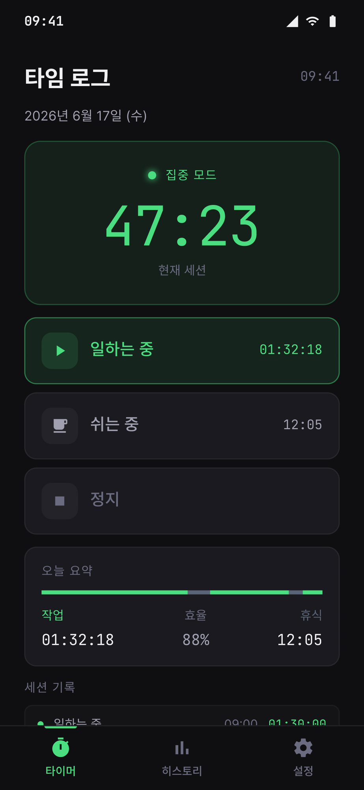
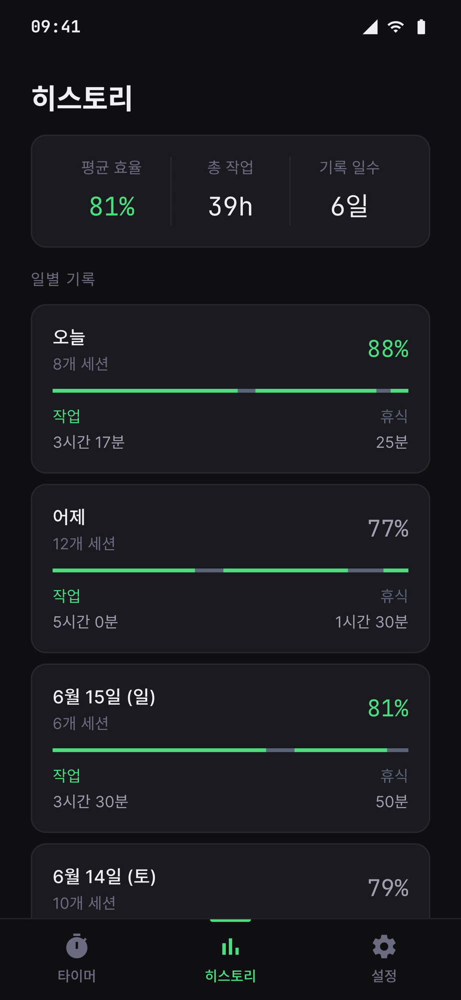
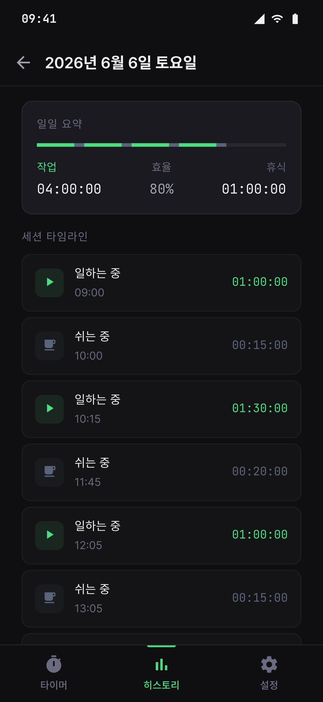
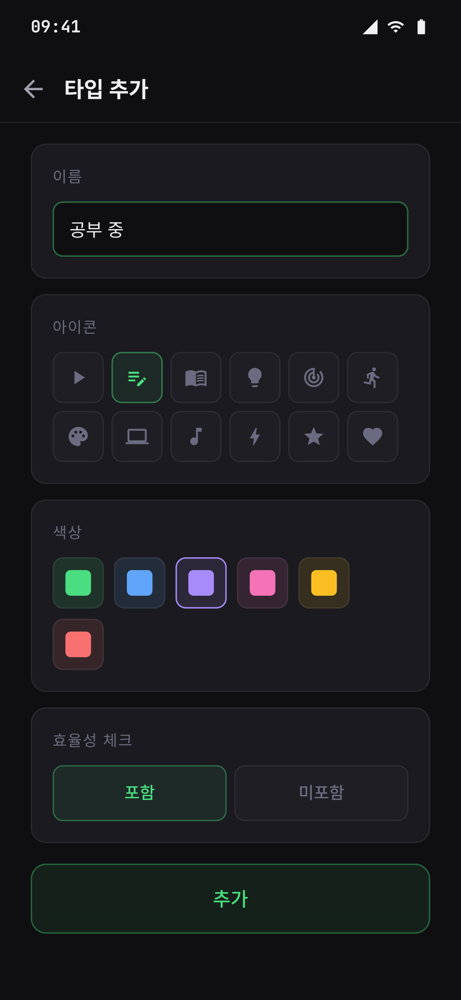

# ⏱️ 타임 로그 (Time Log)

> 집중한 시간을 기록하고, 매일의 효율을 돌아보는 가장 단순한 방법

타임 로그는 **"오늘 나는 얼마나 집중했을까?"** 라는 질문에 숫자로 답해주는 시간 기록 앱입니다.
복잡한 설정이나 할 일 목록 없이, 버튼 하나로 시작하는 스톱워치와 하루를 한눈에 보여주는 효율 리포트만 남겼습니다.

 

## 이런 분들을 위해 만들었어요

- 공부·작업 시간을 **그냥 흘려보내지 않고 기록**하고 싶은 분
- 하루가 끝났을 때 **"실제로 얼마나 집중했는지"** 객관적인 수치로 확인하고 싶은 분
- 뽀모도로처럼 정해진 틀이 아니라, **내 리듬대로 집중과 휴식을 오가며** 시간을 쌓고 싶은 분

 

## 주요 기능

### 🎯 집중 타이머
지금 무엇을 하고 있는지 고르고 시작 버튼만 누르면 끝.
**집중 모드 / 휴식**을 자유롭게 오가며 시간을 기록하고, 화면 아래 *오늘 요약*에서 작업·휴식 비율과 현재 효율을 실시간으로 확인할 수 있습니다.

### 📊 히스토리
매일의 기록이 자동으로 쌓입니다.
**평균 효율 · 총 작업 시간 · 기록 일수**를 한눈에 보고, 날짜를 선택하면 그날의 모든 세션을 시간 순 타임라인으로 다시 들여다볼 수 있습니다. *어제보다 오늘 더 집중했는지* 막대 그래프 하나로 바로 보여요.

### 🎨 나만의 활동 타입
'일하는 중', '공부 중', '운동'처럼 활동을 직접 만들고
**아이콘과 색상**으로 꾸밀 수 있습니다. 활동마다 **효율 계산에 포함할지** 여부를 정할 수 있어, 진짜 집중한 시간만 효율로 환산됩니다.

 

## 스크린샷

| 타이머 | 히스토리 | 일별 타임라인 | 타입 추가 |
|:---:|:---:|:---:|:---:|
|  |  |  |  |
| 집중 모드와 오늘 요약 | 일별 효율 한눈에 | 세션별 상세 기록 | 아이콘·색상 커스터마이징 |

 

## 다국어 지원

🇰🇷 한국어 · 🇺🇸 English · 🇯🇵 日本語 · 🇪🇸 Español
기기 언어에 맞춰 날짜·시간 표기와 텍스트가 자동으로 바뀝니다.

 

## 디자인

어두운 배경 위 또렷한 그린 포인트 컬러로, 밤늦은 작업에도 눈이 편안한 **다크 테마**를 기본으로 합니다.

 

---

*Android · Jetpack Compose (Material3)로 만들어졌습니다.*
